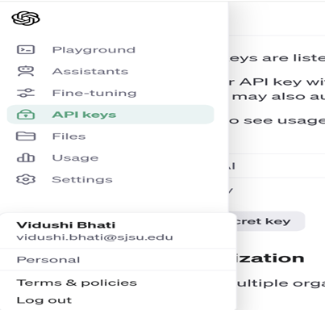
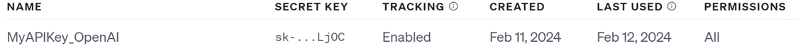
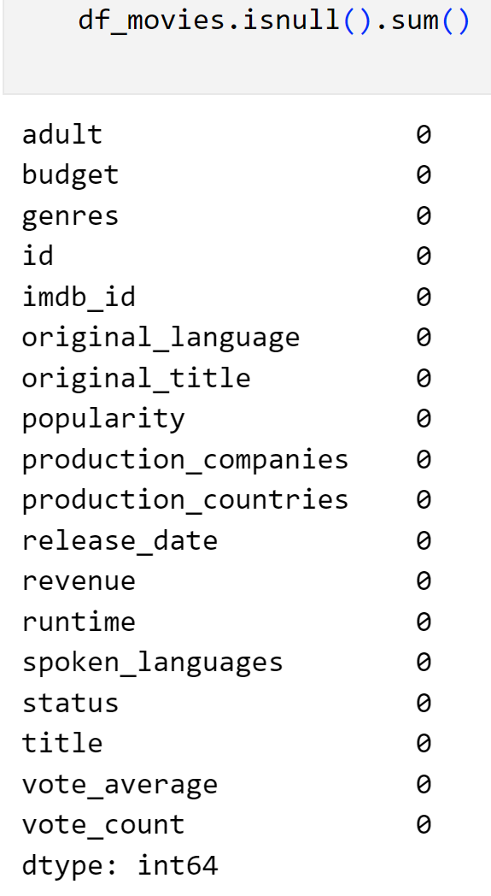
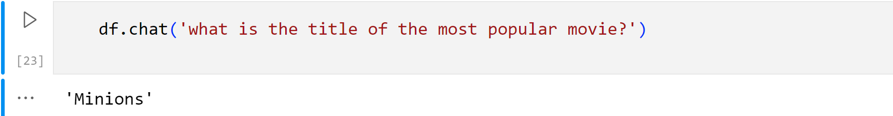

# Analysis Using PandasAI 

## Install PandasAI


## Dataset 
Data set from Kaggle is used for this analysis can be found in the link below :

[Kaggle Dataset for Movies ](https://www.kaggle.com/datasets/rounakbanik/the-movies-dataset)

### CSV File 
Once data is downloaded and uncompressed, following CSV should be present.


## Setup Environment

### Import PandasAI 


### Load the selected dataset 


### Start Converstation with PandasAI

To start conversation with PandasAI, OpenAI API_TOKEN will be required. Use the email address to signup with OpenAI and follow the steps below.

**Get the API token** 

1. Open the link [OpenAI API](https://openai.com/api/) after signing up with the email and go to the link shown in the image below.



2. On the API Page, select "View API Keys" which is present on the left side of Personal Account Settings.
3. Select create new secret key. After successful creation, the key will be listed. Copy the key in the secure location as it will not be visible again. **(Note : API access is paid service with a minimal cost of less than a dollar for several requests.)**



4. Basic cleaning was performed on the downloaded data set including following:
- Handling missing values 
- Imputation of NaN data
- Handling of JSON elements into list for different columns with JSON Data



## Chat Using PandasAI API
```
from pandasai import SmartDataframe
from pandasai.llm import OpenAI
llm = OpenAI(api_token="<YOUR TOKEN GENERATED>")  # Get API token from https://platform.openai.com/account/api-keys
df = SmartDataframe(df_movies, config={"llm": llm})
```

### Ask Data Insight Question

```
df.chat('what is the title of the most popular movie?')
```

Sample output




