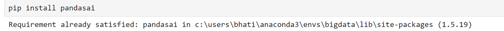
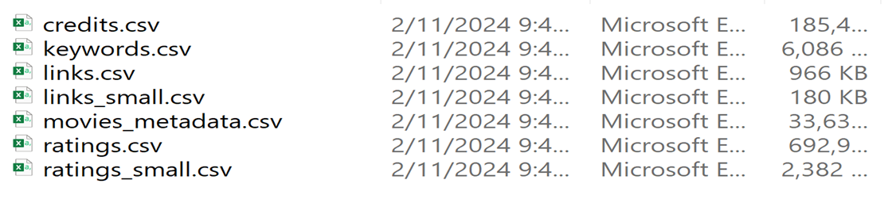
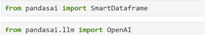
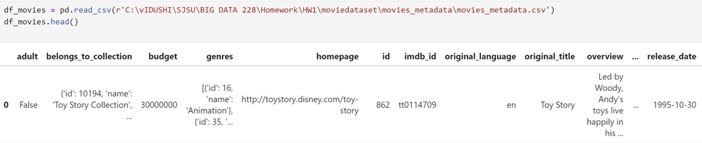

# Analysis Using PandasAI 

## Install PandasAI

## Dataset 
Data set from Kaggle is used for this analysis can be found in the link below :

[Kaggle Dataset for Movies ](https://www.kaggle.com/datasets/rounakbanik/the-movies-dataset)

### CSV File 
Once data is downloaded and uncompressed, following CSV should be present.

## Setup Environment

### Import PandasAI 

### Load the selected dataset 

