# CODE With Cody Plugin in Visual Studio

## Introduction
### Cody is an AI tool to help generate, test and debug code. This tool can be used as an extension for Visual Studio Code, PyCharm and more.

## You can sign up using Github, GitLab, and Google.
https://sourcegraph.com/cody

### Once it is included in the Visual code, you can see it in the menu as shown below.

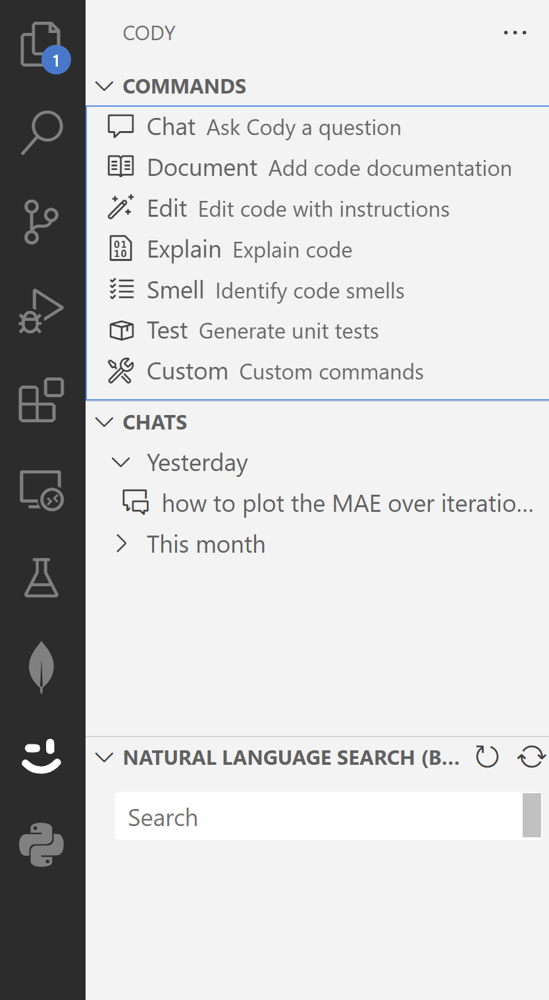

#### Housing dataset is used for showing the code generation.

#### first the dataset is loaded in the Visual Studio Code IDE as shown below:

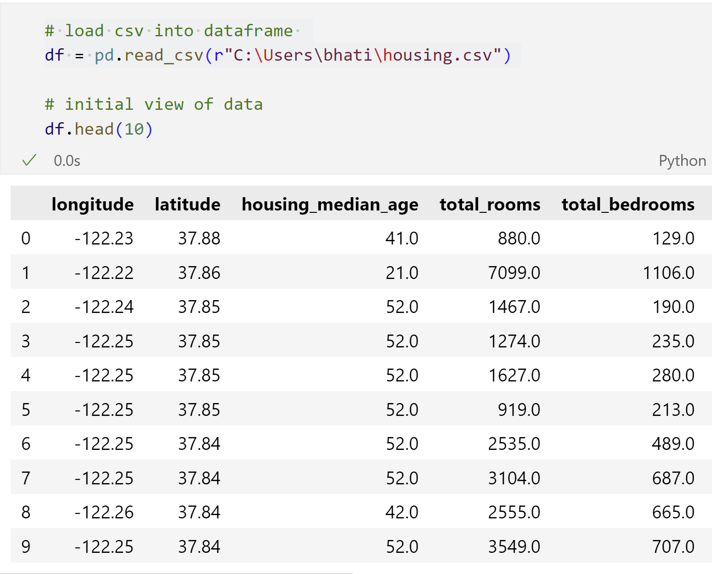

## Cody can do the following as seen in the left hand side tab:
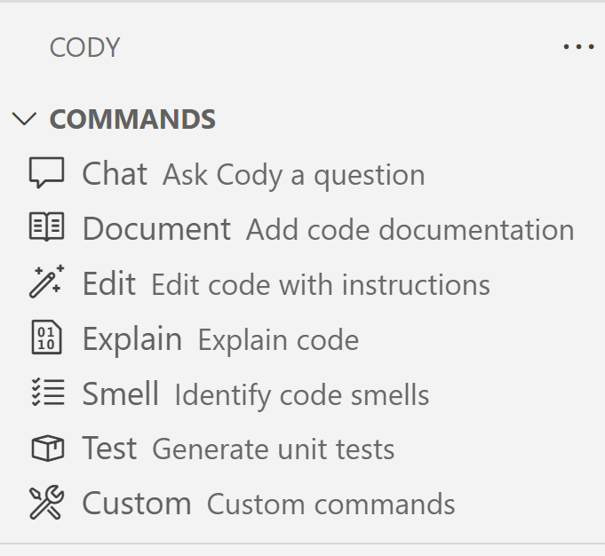

#### You may select and code and click on explain code to understand it.

#### There was only one column with missing values as seen below:
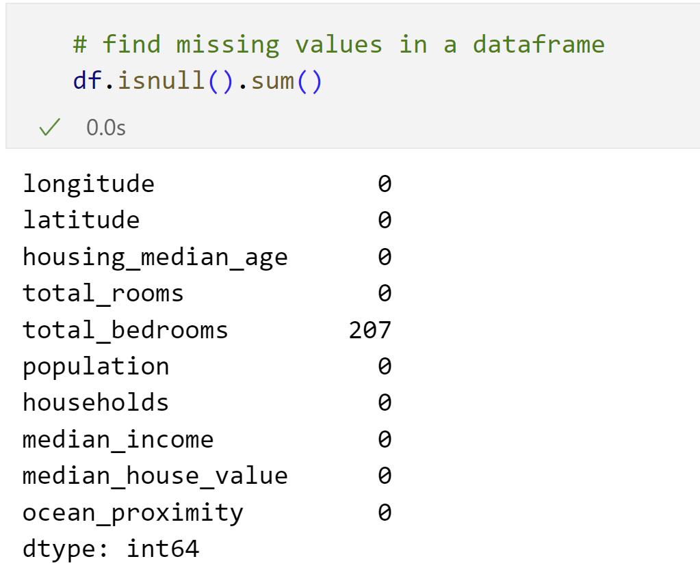 

#### I asked Cody to impute the missing values in my dataset. It provided me with the below code which gave the following output when checked for nulls again.
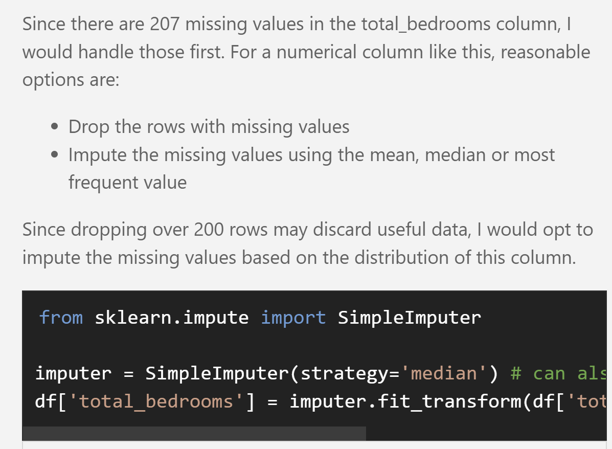

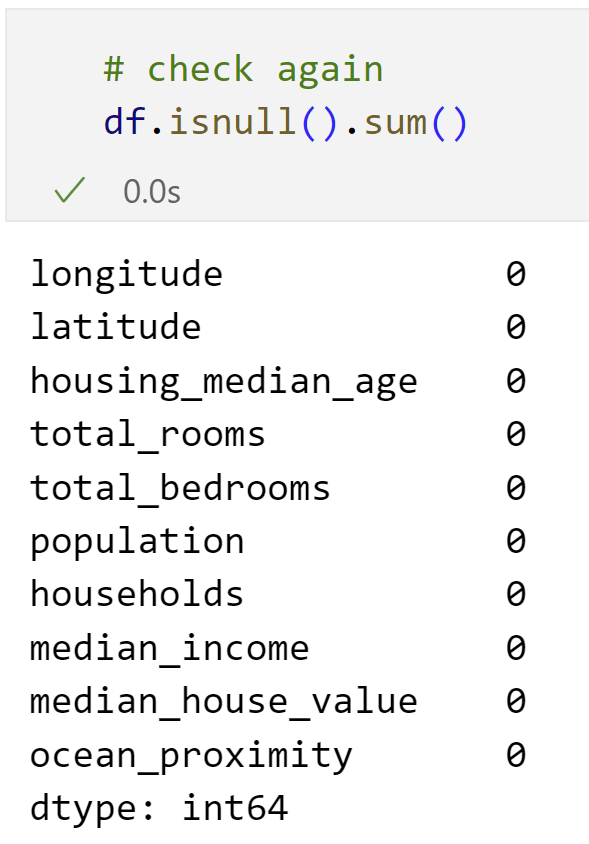

#### For basic model development of XGBoost Regressor and RandomForest as shown below, I asked Cody to smell the code.
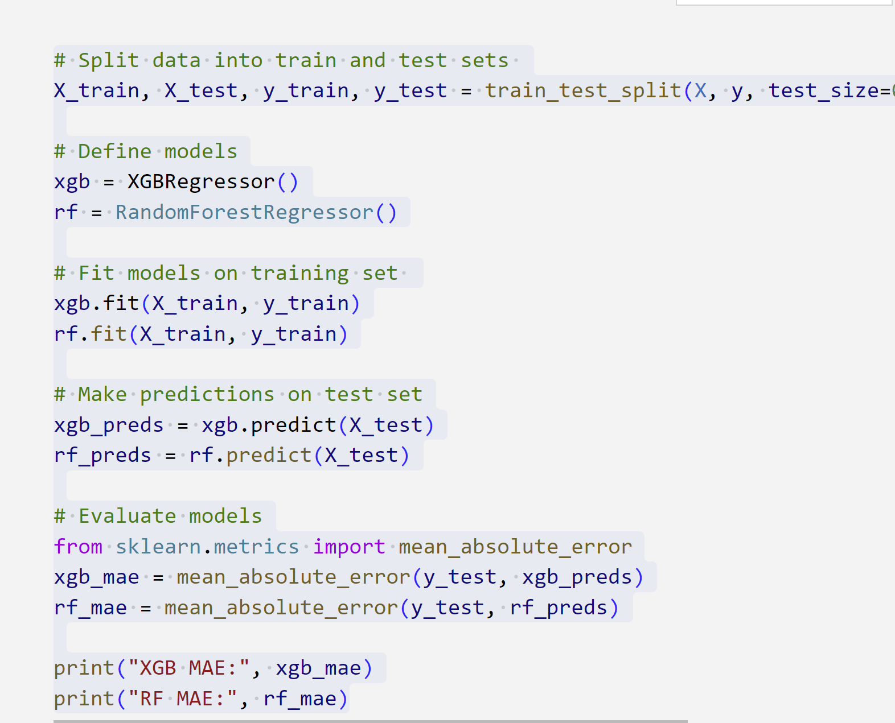

#### It generated the suggestions as follows:
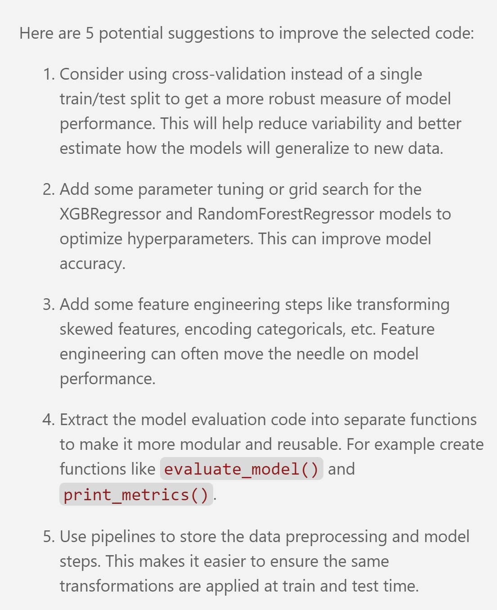

#### I asked Cody to visualize the important features of XGBoost but it didn't give visually appealing result as seen below:
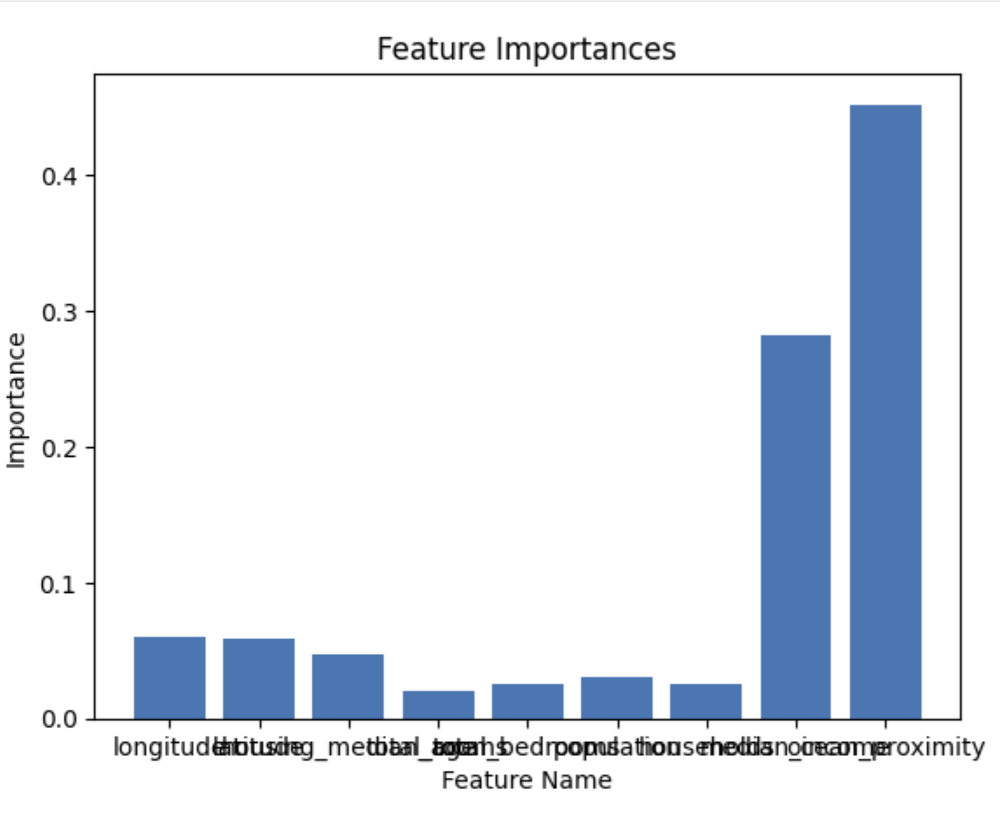

#### I changed it to horizontal bar graph but I guess it could have been done by Cody also if sepecific prompt would have been given.
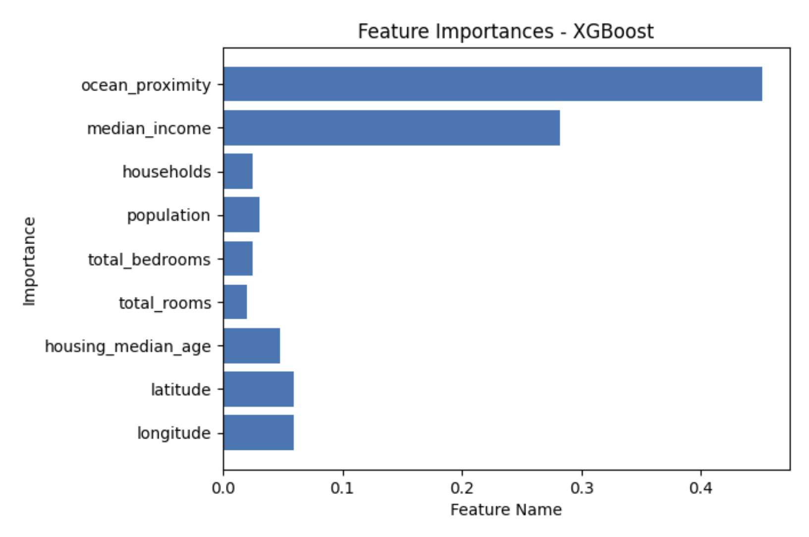

#### for bigger projects, unit test can be generated by selecting a peice of code and clicking Test Generated Unit Code.
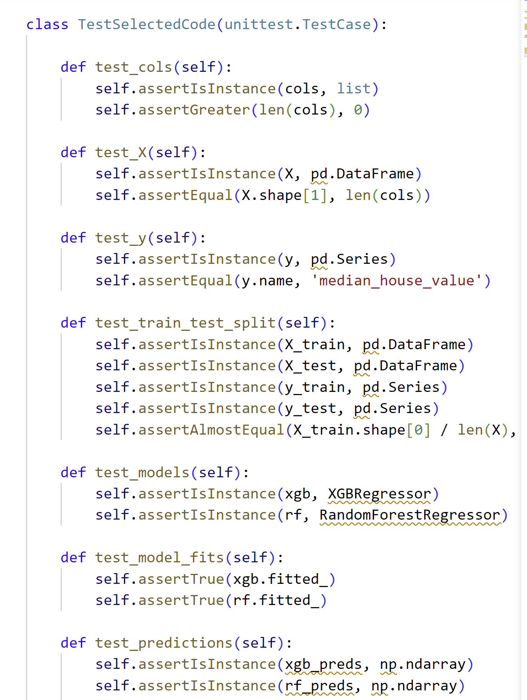
####  However, The unit test would need the actual .py file containing the selected code to import it.

#### At last it generated the code after extensive prompt engineering to show the impact of exclusion of features on mean absolute error using XGBoost and RandomForest as seen below.
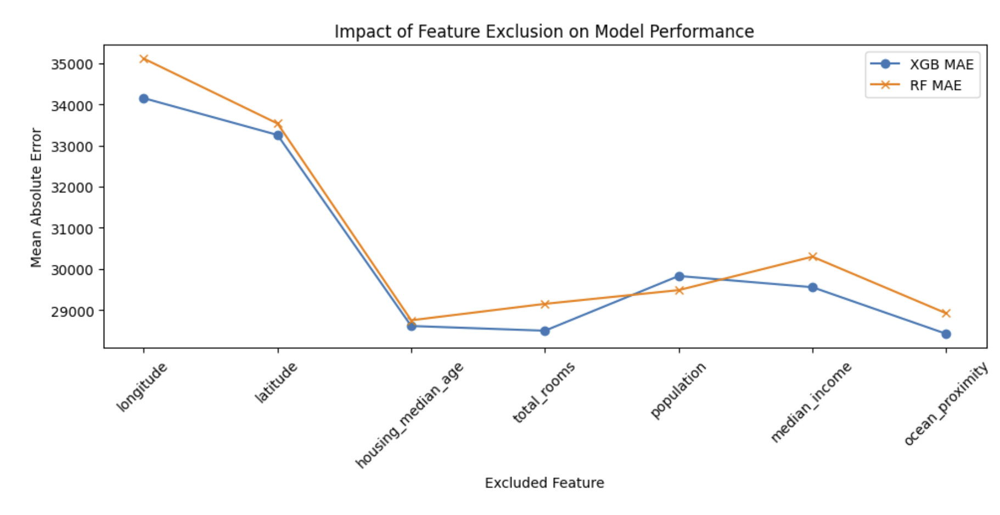

#### In all, it is a pretty impressive tool that may help you with your code development and testing.Happy Coding!

