# Map Reduce with Hadoop

## This Blog is about configuring Hadoop and Using MapReduce

### First Install the hortonworks.sandbox 
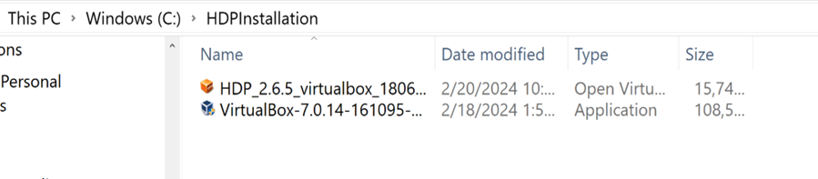

### Install the virtual box and ova file on you system and start the virtual machine.
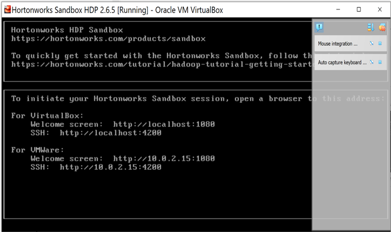

#### Ambari UI can be started from http://localhost:1080 and all the services can be seen running
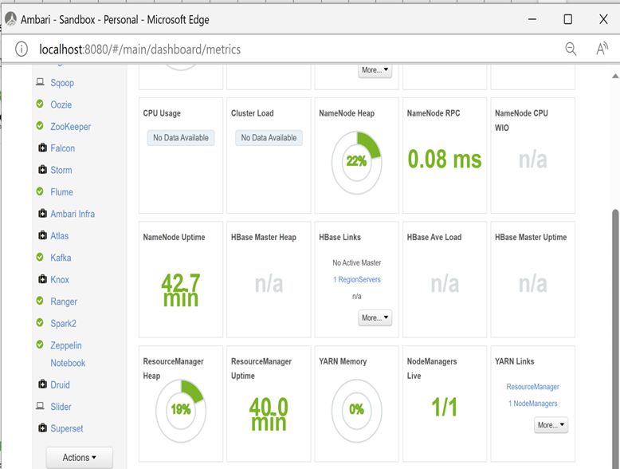

### Install Putty and login with the hadoop machine credentials
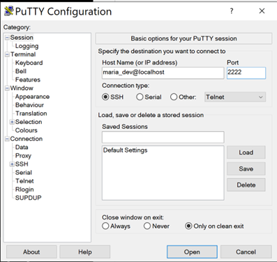

### check for hdfs files and open Hive shell to see databases present 
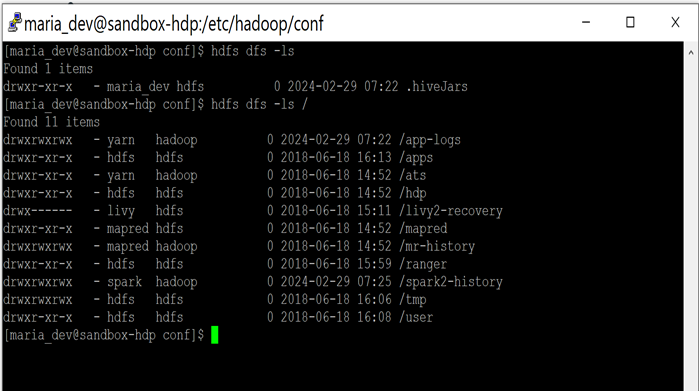
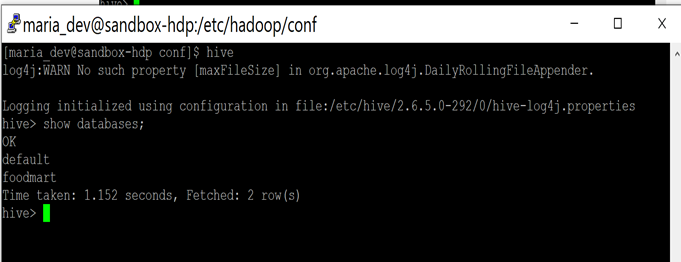

### upload dataset from google and create database table
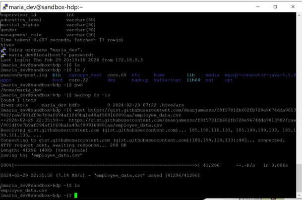
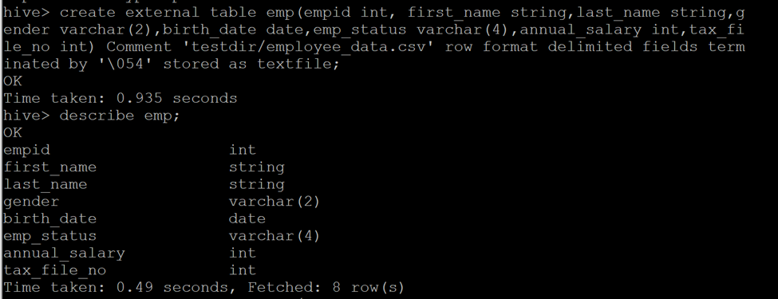

### Since we are pursuing a career in Data Analytics, we are intrigued to know how much the salary differentiation between different job profiles in a company is; more specifically how jobs related to data science differ with other regarding monitory parameters. To explore this, we have chosen a Kaggle dataset https://www.kaggle.com/datasets/iqmansingh/company-employee-dataset

### write the mapper reducer code to get the average salary per department per company and port it to hadoop cluster
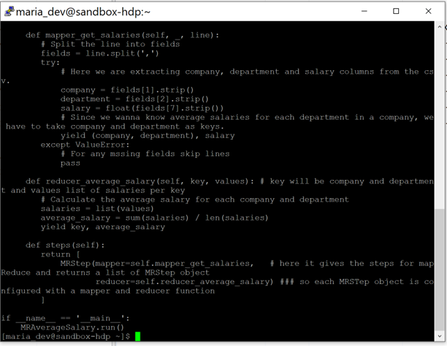
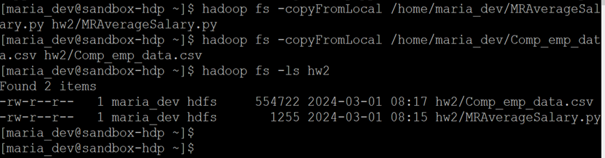

### Before putting on the cluster the program is run on local machine and output is directed to a file as below:
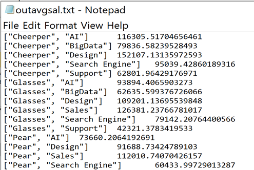

### run the program on the cluster
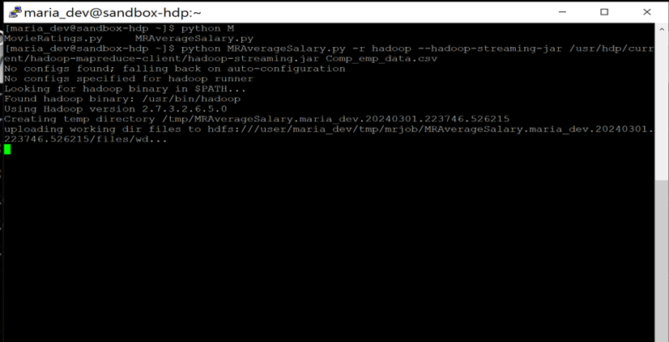

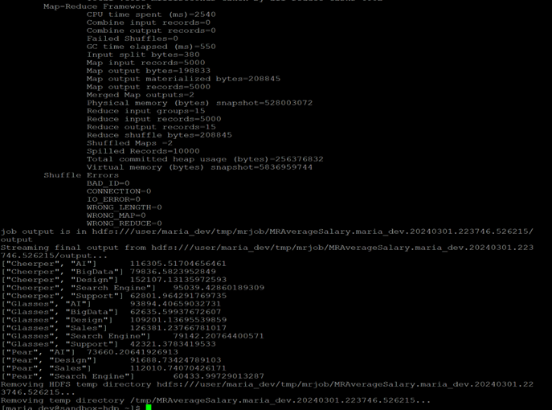

### As can be seen from the output of cluster and the local files, the output is same. So, program is working fine.

