# Spark Kafka Hive Integration
### Before building an application, let’s first simulate the basic real-time data ingestion using command line interface. Now to work with Kafka, we need to locate kafka broker configurations that is present in /usr/hdp/current/kafka-broker/conf

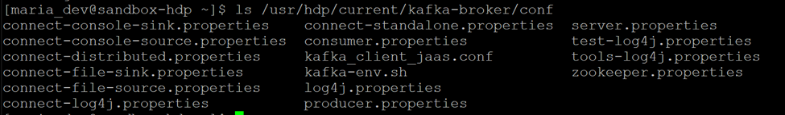
### Consumer-standalone.properties that will be used to make connections to outside text log file and connect to a kafka topic. Also, connect-file-sink.properties and connect-file-source.properties are required. We need to define the source, sink, and the kafka topic. Copy to home directory.
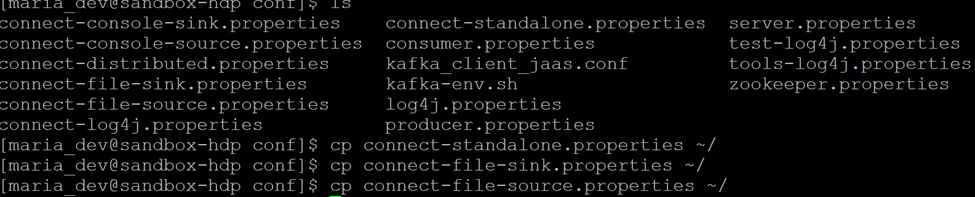

### Kafka is run from /usr/hdp/current/kafka-broker/bin. After creating topic, one can used pre-defined producer and consumer scripts to run the real-time processing. To create kafka topic, we need to provide address of the zookeeper, replication factor and partitions, and topic name as seen in the command below:
#### ./kafka-topics.sh –create –zookeeper sandbox-hdp.hortonworks.com:2181 –replication-factor 1 –partitions 1 –-topic test_topic
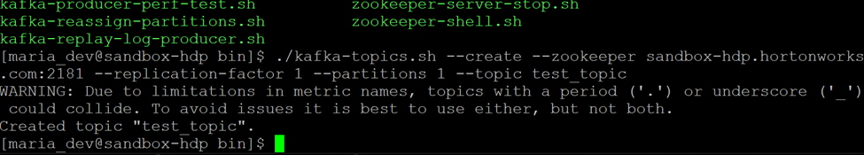

### To list all the topics, below command is needed:
### ./kafka-topics.sh –create –zookeeper sandbox-hdp.hortonworks.com:2181
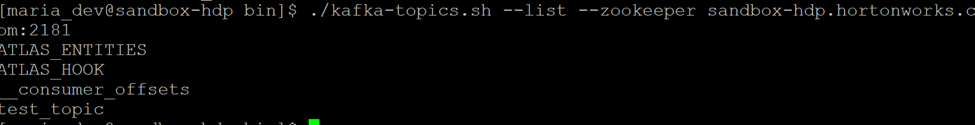

### Now test_topic is created, lets ingest some data into it. For that we need to start the producer and consumer application.To test, lets try with writing directly onto the command line that the producer will read and write on the topic and from the topic consumer will read and show.For running producer, we need to write –list of brokers and give the address of the broker with any given open port.
### ./kafka-console-producer.sh --broker-list sandbox-hdp.hortonworks.com:6667 --topic test_topic
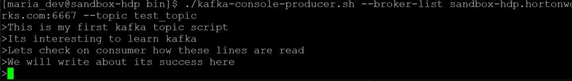

### Now lets check on the consumer console, there we do not need to give list of broker but just need to give zookeeper path and topic name with parameter from beginning that will read the message from the beginning as follows:
### ./kafka-console-consumer.sh –zookeeper localhost:2181 –-topic test_topic –from-beginning
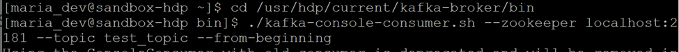

### On both both producer(left side) and consumer(right side) windows, the data is now reflected:
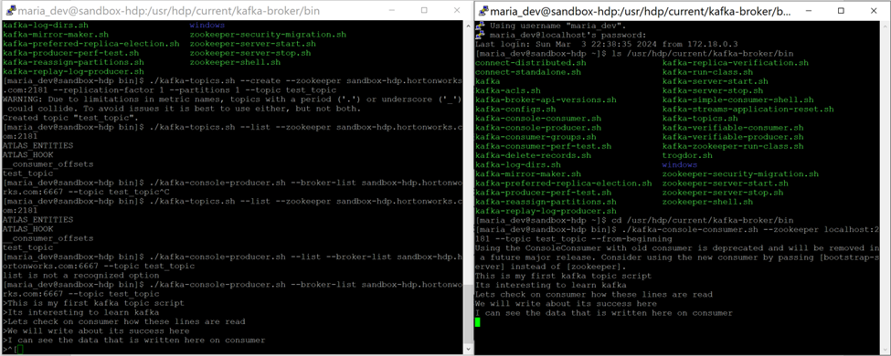

### For working with external data, go to kafka-broker/conf and edit (preferably make copies of these files in user directory and edit them)
### connect-standalone.properties, connect-file-sink.properties, connect-file-source.properties
### connect-standalone.properties change the address of bootstrap.servers as below:
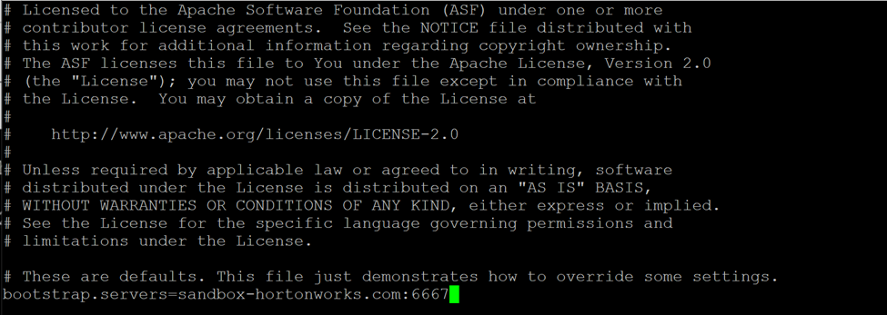

### Make change to connect-file-sink.properties file and topics as below: 
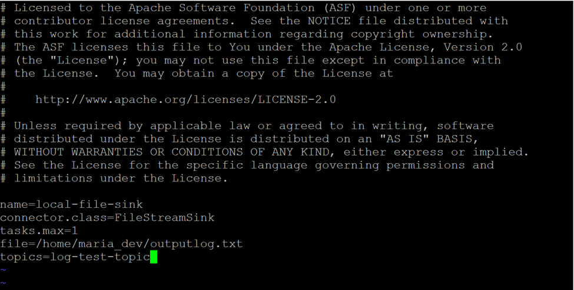

### Make change to connect-file-source.properties file and topics as below: 

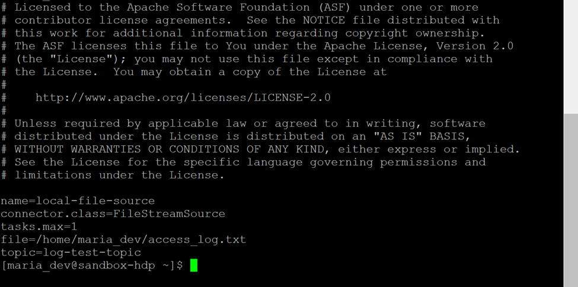
### Generate any log file and import it to the linux box 
### Create topic in kafka 
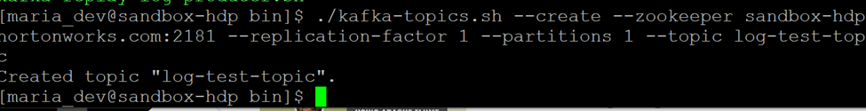
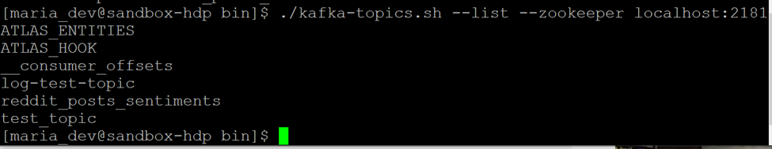

### Retrieve the auth token from reddit API and clean the dataset
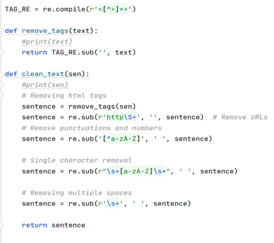
### Extracting id, Kafka subreddit, title, description( cleaned selftext) from Reddit response Json objects
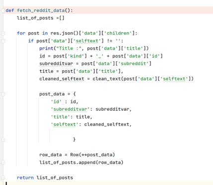

### initiate spark session
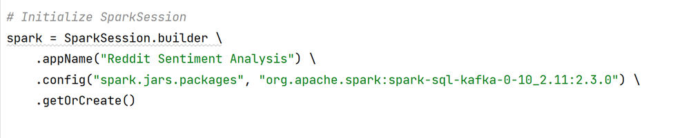

### Perform sentiment analysis on the cleaned description of the post using VADER. Kept the sentiments as negative for less than 0.4 compound score, neutral for less than 0.7 compound score and positive if more than 0.7. New columns have been created for compound score and sentiment label and added to the dataframe which is then posted to the topic for kafka consumer to read.

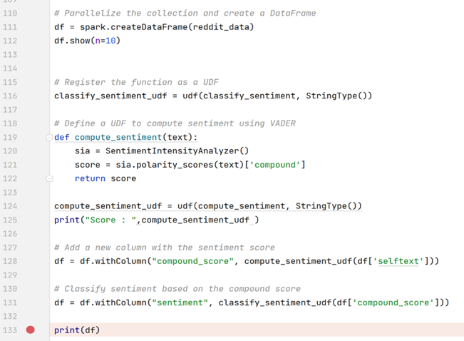

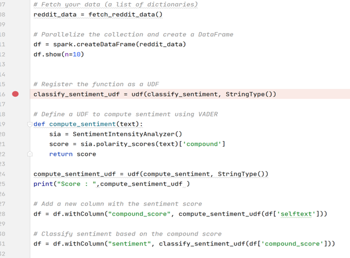

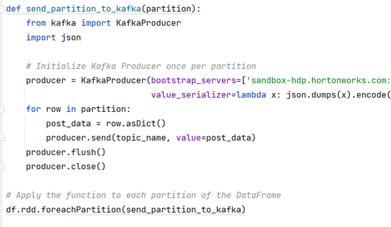

### Output console snippet of producer program showing the dataframe of 10 rows as seen above in code:
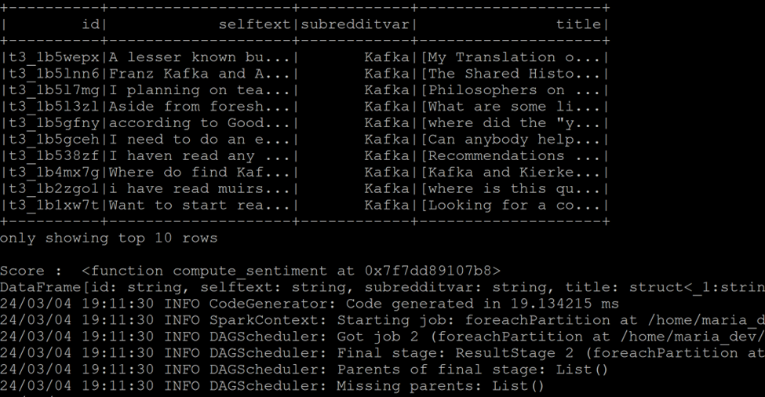

### Below is the output of consumer console where all the messages are received.
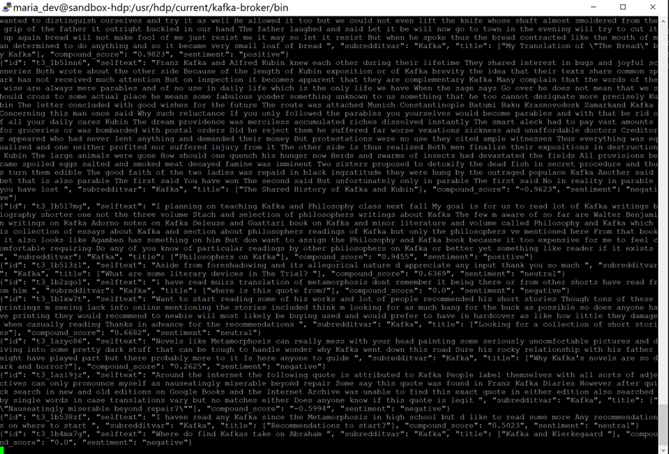

### Created database on HIVE and used it and created table to store the sentiments in parquet format as shown below:
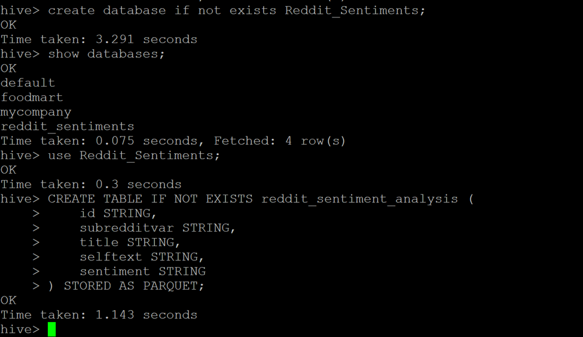

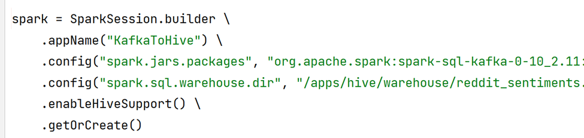

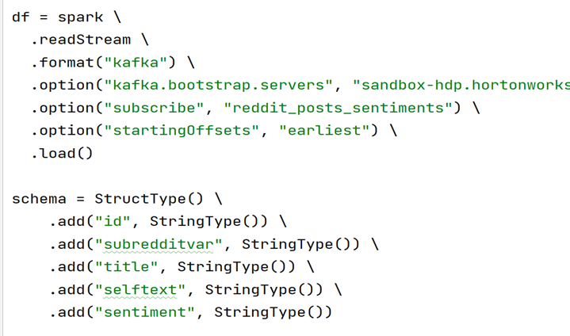

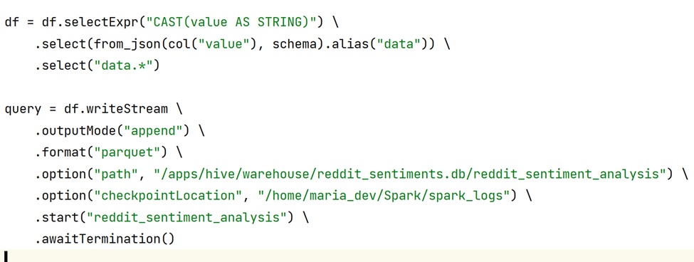

### Consumer output console
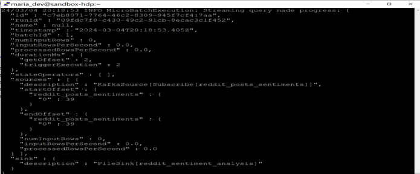

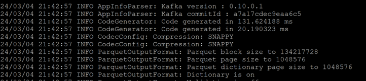

### the data stream can be seen loaded in the HIVE table
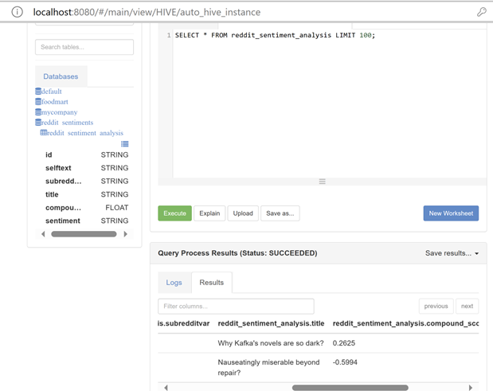

### used Ambari to visualize data, the sentiments are almost equal for all types of subreddits.
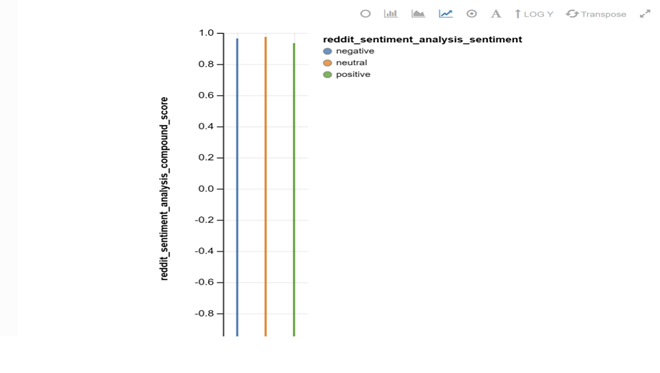
